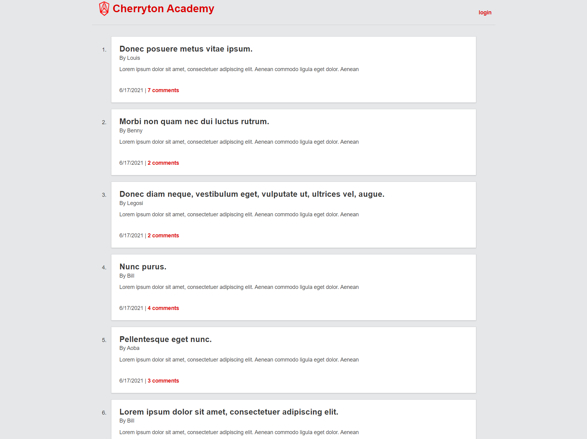

# Cherryton Academy
URL to this repository: https://github.com/LifeInvaderr/cherryton-academy

URL to the deployed page: https://cherryton-academy.herokuapp.com/

## Description
Cherryton Academy is a mockup website from the manga and animated series Beastars.
Users are able to signup, post and comment on other users posts.

## Table of contents
* [Technologies](#technologies)
* [Installation](#installation)
* [Usage](#usage)
* [Questions](#questions)

## Technologies
* Handlebars
* Bulma/CSS
* Sequalize

## Installation

To install this repository, please either clone or install the zip version.

Once installed, you will need to run `npm install` to download the needed node module.

To run locally, please use `npm start` to initialize the files

## Usage
With Cherryton Academy, users are able to signup, post and comment on other users posts.

With each post on the board, users names, time of posting, and comments are displayed.

## Questions

For any questions or concerns, please email me at matthewkausfox@gmail.com

Thank you!